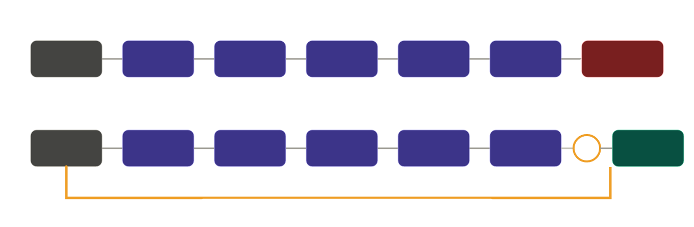
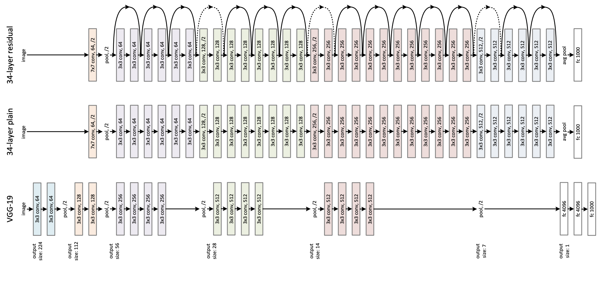

# Project6_Pneumonia_Classification
Classification of people having pneumonia with pytorch

## THEORY BEHIND RESNET
Basically:
- CNNs are a broad family of NNS that use convolutional layers to extract features from imgs- pooling, activation functions and fcls are part of the architecture
- ResNet (Residual Network) is a specific type of CNNs that solve the vanishing gradient problem in very deep networks. 

If you stack more layers in a CNN, you'd think you will get a better accuracy tho thats not the case. Gradients shrink to near 0 during backpropagation thru many layers, so the beginning layers stop learning. 

ResNet has skip connections which create a highway for the original signal (and grads during training) to travel directly form start to end w/o passing thru every layer. The layers still learn but w/o lsing original info.

Simple analogy: Imagine you're editing an essay. In a normal CNN, you'd reqrite the entire essary from scratch every time you pass thru a layer and the more rewrites you do, the more the original meaning gets lost. In a ResNet approach, you keep the original essay and only write down what needs to be changed. Then add your small fixes back to the original. The original is always preserved. 

"Add your fixes back onto the original" IS the skip connection. The layers learn the small fix -> F(x), The original is carried forward -> x, and the final output becomes F(x) + x. 

Below is the architecture of ResNET, CNN and VGG19 for reference:

## DATASET
The pneuomonia classification dataset is organized into 3 folders (train, test, val) and contains subfolders for each image category (Pneumonia/Normal). There are 5,863 X-Ray images and 2 categories (Pneumonia/Normal).

Load the train, test and val for Pneumonia Classification dataset and transform data by resizing to 224x224 px, converting to tensor and normalizing. Use data loaders to load the train, test and val datasets in batch sizes of 32 whilst only shuffling training data.

## MODEL TRAINING: DEFINE RESNET
Load the RESNET model with pre existing weights and add a fcl to 
get two ouputs- Pneumonia or normal. 

Define loss function as cross entropy loss and optimizer as Adam to optimize model parameters. Start model training: for each epoch, for features and target in training set, reset the gradients to 0, get model output for given input, calculate loss using cross entropy loss, backpropagate loss, take a step with optimizer in right direction.

## MODEL EVALUATION
Evaluate model on unseen data. Disable gradient calculation because we're not doing training. Get predictions for test set, calculate the max arg from the predictions to find highest activation and find accuracy.

